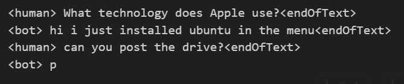

# KAN-GPT
This is a mock implementation of GPT-2 model where the MLP layer is replaced with KAN (Kolmogorov–Arnold Networks). KAN offers better accuracy with less parameters according to the paper 'KAN: Kolmogorov–Arnold Networks arXiv:2404.19756'

# Training 
Create or Download a txt file for dataset 

```bash
python train.py data.txt 
```

# Text Generation
Check generate.ipynb for details. 

# Demo



# References 
- Blealtan/efficient-kan
- karpathy/minGPT